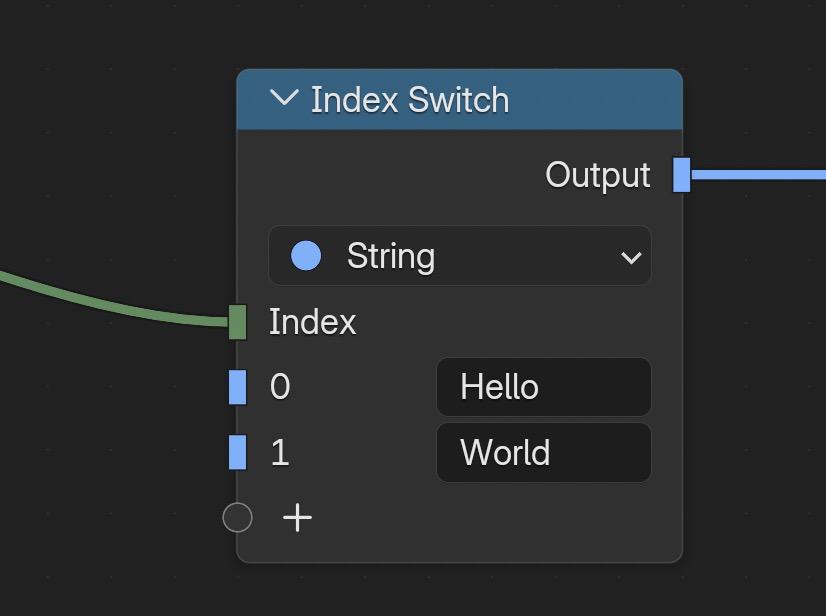

Here are 4 different approaches to load data into the Blender spreadsheet via API:

1. **CSV** - Load from CSV files
2. **DataFrame** - Load directly from Polars DataFrames
3. **JSON** - Load from JSON/dictionary data
4. **Excel** - Load from Excel files

---

# CSV to Blender

Load data from a CSV file into Blender.

```python
from io import StringIO
from pathlib import Path
import bpy

from csv_importer.csv import load_csv

csv_data = StringIO(
    """
FloatVal,IntVal,BoolVal,StringVal
1.23,10,true,Hello
4.56,20,false,World
"""
)

temp_dir = Path(bpy.app.tempdir)
csv_path = temp_dir / "example.csv"

csv_path.write_text(csv_data.getvalue().strip(), encoding="utf-8")

obj = load_csv(csv_path)
print(obj.name)
```


!!! note
    String columns are stored as integers (indices). In Geometry Nodes, search for "CSV" to find the Index Switch node, which lets you access the actual string values.

    

---

# DataFrame to Blender

Load data directly from a Polars DataFrame.

```py
import polars as pl
from csv_importer.parsers import polars_df_to_bob

df = pl.DataFrame([
    pl.Series("Intensity", ["Hello", "World"]),
    pl.Series("opacity", [0.34, 0.92]),
    pl.Series("Is_Visible", [True, False]),
    pl.Series("Star", [[3.4, 3.5, 0.0], [3.1, 5.6, 0.0]]),
])
obj = polars_df_to_bob(df, name="MeshVector")
``` 

---

# JSON to Blender

Load data from a Python dictionary (JSON-like structure) by converting it to a DataFrame first.

```py
import polars as pl
from csv_importer.parsers import polars_df_to_bob

json_data = {
    "Intensity": ["Hello", "World"],
    "opacity": [0.34, 0.92],
    "Is_Visible": [True, False],
    "Star": [
        [3.4, 3.5, 0.0],
        [3.1, 5.6, 0.0]
    ]
}

df = pl.DataFrame(json_data)
obj = polars_df_to_bob(df, name="MeshVector")
```

---

# Excel to Blender

Load data from an Excel file. This example has two parts: first we create an Excel file, then we read it into Blender.

## Step 1: Create an Excel file (optional)

Skip this if you already have an Excel file.

```py
# Uncomment once to install:
# import subprocess, sys
# subprocess.check_call([sys.executable, "-m", "pip", "install", "xlsxwriter"])

import bpy
import polars as pl
from pathlib import Path

data_polars = pl.DataFrame({
    "MyFloat": [42.12, 12.33],
    "Is_Visible": [True, False],
    "Intensity": [10, 20],
})

temp_dir = Path(bpy.app.tempdir)
path = temp_dir / "simple_excel_polars.xlsx"

data_polars.write_excel(path)
```

## Step 2: Load Excel into Blender

```py
# Uncomment once to install:
# import subprocess, sys
# subprocess.check_call([sys.executable, "-m", "pip", "install", "fastexcel", "pyarrow"])

import bpy
import polars as pl
from pathlib import Path
from csv_importer.parsers import polars_df_to_bob

temp_dir = Path(bpy.app.tempdir)
path = temp_dir / "simple_excel_polars.xlsx"

df = pl.read_excel(path, sheet_name="Sheet1")
obj = polars_df_to_bob(df, name="MeshVector")
```
