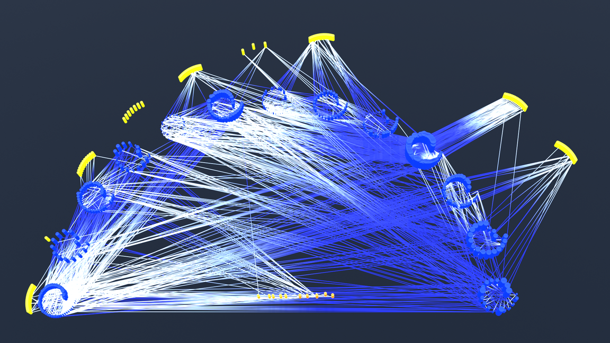

# Network Visualization

In this tutorial, we will learn how to visualize a **network** in Blender 5.0.1.

Here's how the final result looks as an image:

## Preparing Data

*Coming soon.*

## Import into Blender

First, install the [CSV Importer](https://extensions.blender.org/add-ons/csv-importer/) add-on and drag'n'drop the dataset into Blender's viewport.

*Coming soon.*

If you come up with your own creations and post them online, you're welcome to tag me on [Bluesky](https://bsky.app/profile/kolibril13.bsky.social)!
