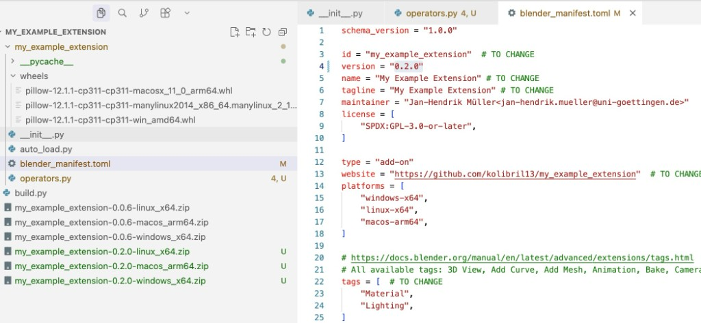
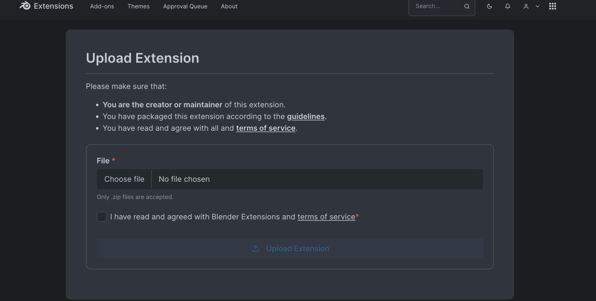

# How to Build an Extension

This guide walks you through building a Blender extension from scratch. Extensions have been the standard way to distribute add-ons since Blender 4.2, available via the [Extensions Platform](https://extensions.blender.org/).

The tutorial was written for Blender 5.0.1, using VS Code with the [Blender Development](https://marketplace.visualstudio.com/items?itemName=JacquesLucke.blender-development) extension.

## Chapter 1: Create a New Add-on

To get started, open the **Command Palette** in VS Code and run **Blender: New Addon**.  
When prompted, choose the **with auto reload** option.  
This adds an `auto_load.py` script that automatically discovers every Panel, Operator, and PropertyGroup in your add-on, resolves their dependencies, and registers them in the correct order. It means you can simply drop new `.py` files into your project and they will be picked up without any manual wiring in `__init__.py`.


## Chapter 2: Adding Python Dependencies with Wheels

Blender extensions can bundle third-party Python packages as `.whl` (wheel) files. The Python ecosystem has many well-maintained packages: e.g. **Pillow** for image manipulation, **Requests** for fetching data from the web, or **NetworkX** for creating and analyzing networks.

A `build.py` script automates the entire process: downloading platform-specific wheels, updating `blender_manifest.toml`, and packaging the extension. Simply add your dependencies to the script and run it with:

```bash
/Applications/Blender.app/Contents/MacOS/Blender -b -P build.py
```

For a working example, see [build.py from blur_hdri](https://github.com/kolibril13/blur_hdri/blob/main/build.py).

!!! note
    Place the `build.py` script one level above the directory where your add-on lives.

For example, when adding **Pillow** as a dependency, this is how the folder structure would look after running `build.py` — with platform-specific `.whl` files in a `wheels` folder and the final `.zip` packages ready for upload:


## Chapter 3: Adding an Operator

To add functionality to your add-on, create an Operator. Thanks to `auto_load.py`, you can simply add a new file — e.g. `operators.py` — and it will be automatically discovered and registered.

Since we bundled Pillow as a wheel in Chapter 2, we can now use `from PIL import Image, ImageFilter` directly in our add-on code.

<details>
<summary>Example operator: operators.py (click to expand)</summary>

```python
import bpy
from bpy.props import FloatProperty
from bpy.types import Operator
from PIL import Image, ImageFilter
import os

class NODE_OT_blur_env_image(bpy.types.Operator):
    bl_idname = "node.blur_env_image"
    bl_label = "Blur Environment Image"
    bl_options = {'REGISTER', 'UNDO'}

    radius: FloatProperty(
        name="Blur Radius",
        description="Radius for Gaussian Blur",
        default=5.0,
        min=0.1,
        max=100.0
    )

    def execute(self, context):
        world = context.scene.world
        if not (world and world.node_tree):
            self.report({'ERROR'}, "No world node tree found.")
            return {'CANCELLED'}
        nodes = world.node_tree.nodes
        selected_nodes = [n for n in nodes if n.select]
        if not selected_nodes:
            self.report({'ERROR'}, "No node selected.")
            return {'CANCELLED'}
        node = selected_nodes[0]
        if not hasattr(node, "image") and node.image and node.image.filepath:
            self.report({'ERROR'}, "Selected node is not an image node or has no image.")
            return {'CANCELLED'}
        img_path = bpy.path.abspath(node.image.filepath)
        try:
            img = Image.open(img_path)
            blurred = img.filter(ImageFilter.GaussianBlur(radius=self.radius))
            base, ext = os.path.splitext(img_path)
            blurred_path = base + "_blurred" + ext
            blurred.save(blurred_path)
            env_node = nodes.new(type='ShaderNodeTexEnvironment')
            env_node.location = (node.location[0], node.location[1] - 300)
            env_node.image = bpy.data.images.load(blurred_path)
        except Exception as e:
            self.report({'ERROR'}, f"Error processing image: {e}")
            return {'CANCELLED'}
        return {'FINISHED'}

    def invoke(self, context, event):
        return context.window_manager.invoke_props_dialog(self)
```

</details>

Now we can test the add-on by running **Blender: Build and Start** from the Command Palette.


When Blender starts, search for "blur" in the operator search menu — the **Blur Environment Image** operator will show up. Select an environment texture node, run the operator, and it will successfully blur the texture using Pillow:


## Chapter 4: Upload the Extension

With everything in place, bump the `version` field in `blender_manifest.toml` and run `build.py` again to produce new `.zip` files — one per platform:

```bash
/Applications/Blender.app/Contents/MacOS/Blender -b -P build.py
```



The resulting `.zip` files can then be uploaded to the [Blender Extensions Platform](https://extensions.blender.org/).


