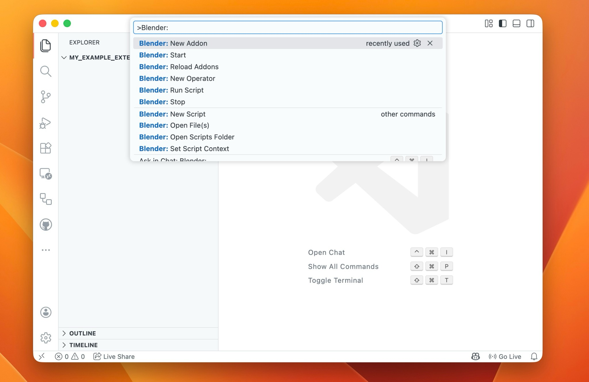

# How to Build an Extension

This guide walks you through building a Blender extension from scratch. Extensions have been the standard way to distribute add-ons since Blender 4.2, available via the [Extensions Platform](https://extensions.blender.org/).

The tutorial was written for Blender 5.0.1, using VS Code with the [Blender Development](https://marketplace.visualstudio.com/items?itemName=JacquesLucke.blender-development) extension.

## Chapter 1: Create a New Add-on

To get started, open the **Command Palette** in VS Code and run **Blender: New Addon**.  
When prompted, choose the **with auto reload** option.  
This adds an `auto_load.py` script that automatically discovers every Panel, Operator, and PropertyGroup in your add-on, resolves their dependencies, and registers them in the correct order. It means you can simply drop new `.py` files into your project and they will be picked up without any manual wiring in `__init__.py`.

## Chapter 2: Adding Python Dependencies with Wheels

Blender extensions can bundle third-party Python packages as `.whl` (wheel) files. The Python ecosystem has many well-maintained packages: e.g. **Pillow** for image manipulation, **Requests** for fetching data from the web, or **NetworkX** for creating and analyzing networks.

A `build.py` script automates the entire process: downloading platform-specific wheels, updating `blender_manifest.toml`, and packaging the extension. Simply add your dependencies to the script and run it. For a working example, see [build.py from blur_hdri](https://github.com/kolibril13/blur_hdri/blob/main/build.py).
