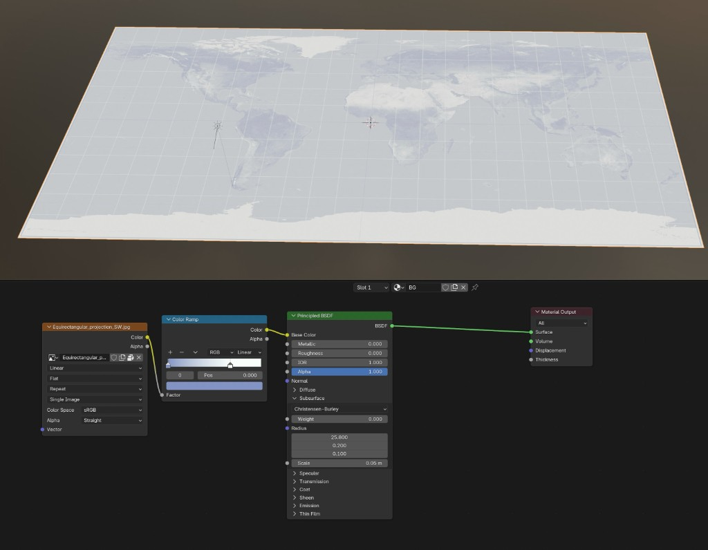

# World Population Time Series

## Preparing Data

In this tutorial, we will learn how to visualize a time series of the world population. We will start with a simple CSV file that contains urban agglomeration population data from the [United Nations World Urbanization Prospects](https://population.un.org/wup/downloads?tab=Countries%20and%20Aggregates) (WUP2018).

[Download WUP2018-F22-Cities_Over_300K_Annual.csv](assets/WUP2018-F22-Cities_Over_300K_Annual.csv){ .md-button }

From this dataset, we want the following columns:

- **Latitude** and **Longitude** — the geographic coordinates
- **1950–2035** — the population values for each year

## Import into Blender

First, install the [CSV Importer](https://extensions.blender.org/add-ons/csv-importer/) add-on and drag'n'drop the dataset into Blender's viewport.

Now we will see the spreadsheet like this:

Next, we add a background image. A good choice is an [equirectangular projection](https://en.wikipedia.org/wiki/Equirectangular_projection) of the Earth, since the latitude and longitude values from our dataset map directly to x and y coordinates in this projection.

*Source: [Wikimedia Commons — Equirectangular projection](https://en.wikipedia.org/wiki/Equirectangular_projection#/media/File:Equirectangular_projection_SW.jpg)*

Now we scale it to match the Earth's longitude and latitude, and adjust the colors with shader nodes:

With this in place, we continue to add the data as bar charts using Geometry Nodes:

To color the bars, we create a separate reference cylinder and assign a material to it. This material uses a Color Ramp driven by the Z height of each bar, so taller bars appear in warmer colors. The Geometry Nodes setup then applies this material to all instanced bars automatically.

